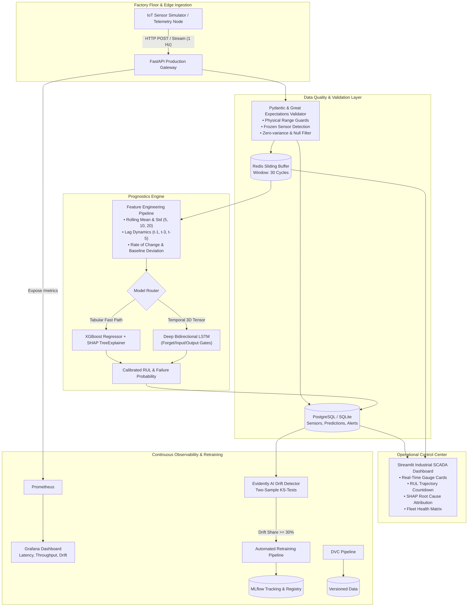

# Sentinel AI — Production Predictive Maintenance Platform

[](https://github.com/HARSHAL-SEMICOLON/Production-Predictive-Maintenance-Platform/actions)
[](https://www.python.org/downloads/release/python-3120/)
[](https://fastapi.tiangolo.com)
[](https://www.docker.com/)
[](https://kubernetes.io/)
[](https://mlflow.org/)
[](https://evidentlyai.com/)
[](https://opensource.org/licenses/MIT)

> **Enterprise-grade predictive maintenance and MLOps platform engineered to predict industrial turbofan engine failure before catastrophic breakdown, deploying live IoT telemetry ingestion, automated feature engineering, XGBoost & Bidirectional LSTM models, SHAP explainability, Prometheus observability, and automated retraining pipelines.**

---

## 📑 Table of Contents
1. [Executive Summary & System Architecture](#-executive-summary--system-architecture)
2. [End-to-End System Flow](#-end-to-end-system-flow)
3. [Tech Stack](#-tech-stack)
4. [Dataset & Physical Domain Formulation](#-dataset--physical-domain-formulation)
5. [Feature Engineering Engine](#-feature-engineering-engine)
6. [Model Architectures: XGBoost vs. Bidirectional LSTM](#-model-architectures-xgboost-vs-bidirectional-lstm)
7. [MLOps Lifecycle, Tracking & Data Lineage](#-mlops-lifecycle-tracking--data-lineage)
8. [REST API Architecture & Prometheus Observability](#-rest-api-architecture--prometheus-observability)
9. [Industrial SCADA Dashboard & SHAP XAI](#-industrial-scada-dashboard--shap-xai)
10. [Containerization & Kubernetes Autoscaling (HPA)](#-containerization--kubernetes-autoscaling-hpa)
11. [Continuous Integration & Delivery (CI/CD)](#-continuous-integration--delivery-cicd)
12. [Evidently AI Drift Monitoring & Retraining Workflow](#-evidently-ai-drift-monitoring--retraining-workflow)
13. [Local Quickstart & Reproduction Guide](#-local-quickstart--reproduction-guide)
14. [Interview Technical Defense Guide](#-interview-technical-defense-guide)
15. [Resume Description (ATS-Optimized)](#-resume-description-ats-optimized)

---

## 🏛️ Executive Summary & System Architecture

In high-reliability industries (aerospace, semiconductor fabrication, energy generation), unplanned machinery downtime costs upwards of **\$260,000 per hour**. Traditional preventive maintenance relies on conservative, calendar-based servicing schedules that discard healthy components prematurely or miss early subsurface fatigue.

**Sentinel AI** transforms predictive maintenance into a closed-loop production system where the machine learning model is merely one operational component in a fault-tolerant software architecture.



---

## 🔄 End-to-End System Flow

1. **Sensor Streaming**: An edge simulator replays turbofan engine runs or synthesizes wear trajectories, transmitting 21 physical sensor channels every second.
2. **Contract Validation**: Incoming payloads pass strict Pydantic physical boundary validation and Great Expectations data quality checks (missing values, duplicated timestamps, frozen sensor checks).
3. **High-Speed Caching**: The reading is cached in Redis (with sliding 30-cycle buffer memory) and committed to the transactional relational database (PostgreSQL / SQLite).
4. **Feature Extraction**: Rolling temporal statistics (windows: 5, 10, 20), lag features ($t-1, t-3, t-5$), rate of change ($\Delta S_t$), and normalized degradation deviations are computed.
5. **Prognostics Inference**: 
   - **XGBoost Regressor** infers Remaining Useful Life (RUL) and evaluates feature importance via SHAP.
   - **Bidirectional LSTM** ingests $(30, 21)$ temporal tensors, capturing wear dynamics across the historical context.
6. **Risk Calibration & Alerting**: Predicted RUL is converted to calibrated failure probability $P(\text{failure}) \in [0, 1]$ via logistic mapping. If $RUL \le 30$ cycles, critical alerts are dispatched.
7. **SCADA Dashboard**: The live Streamlit UI displays gauge cards, countdown degradation trajectories, fleet health matrix, and SHAP explainability.
8. **Drift & Retraining**: Evidently AI monitors production telemetry against the training baseline using Kolmogorov-Smirnov statistical tests. When sensor distribution drift exceeds 30%, the retraining pipeline is dispatched and logged to MLflow.

---

## 🛠️ Tech Stack

| Domain | Technology | Production Role |
| :--- | :--- | :--- |
| **Language & Environment** | Python 3.12, PowerShell, Bash | Core runtime environment |
| **Data Processing** | Pandas, NumPy, SciPy | Telemetry wrangling, rolling calculations |
| **Machine Learning** | XGBoost, Scikit-learn, SHAP | Tabular gradient boosting baseline and feature attribution |
| **Deep Learning** | TensorFlow 2.19, Keras 3.9 | Bidirectional LSTM time-series sequence modeling |
| **API Gateway** | FastAPI, Uvicorn, Pydantic v2 | High-throughput asynchronous REST gateway |
| **Database & Cache** | PostgreSQL 16, SQLAlchemy 2.0, Redis 7 | Relational telemetry persistence and sliding window cache |
| **Dashboard** | Streamlit, Plotly Express | Industrial SCADA operations control center |
| **Experiment Tracking** | MLflow 3.16 | Hyperparameter, metric, and artifact tracking |
| **Data Lineage** | DVC (Data Version Control) | Reproducible multi-stage data pipelines |
| **Model Monitoring** | Prometheus, Evidently AI, Grafana | Request latency, throughput, and sensor covariate drift |
| **DevOps & Containers** | Docker (Multi-stage), Docker Compose | Production containerization and service orchestration |
| **Orchestration** | Kubernetes (Minikube), HPA | Container scaling, health probes, resource limits |
| **CI/CD Automation** | GitHub Actions | Automated linting, pytest suite, and docker builds |
| **Testing** | Pytest, Pytest-cov, HTTPX | Unit, integration, and mock regression testing |

---

## 🛰️ Dataset & Physical Domain Formulation

The platform utilizes the benchmark **NASA C-MAPSS (Commercial Modular Aero-Propulsion System Simulation)** turbofan engine degradation dataset (FD001):
- **100 Training Engines**: Run-to-failure trajectories (130 to 360 cycles).
- **100 Testing Engines**: Trajectories truncated at an arbitrary cycle prior to system failure.
- **Ground-Truth Test RUL**: Terminal cycle countdown ground truth.
- **Operational Variables**: 3 operational settings + 21 sensor channels monitoring temperatures, pressures, rotor speeds, and bypass bleed flows:
  - `sensor_2`: Low Pressure Compressor (LPC) Outlet Temp (T24) [°R]
  - `sensor_3`: High Pressure Compressor (HPC) Outlet Temp (T30) [°R]
  - `sensor_4`: Low Pressure Turbine (LPT) Outlet Temp (T50) [°R]
  - `sensor_7`: HPC Outlet Pressure (P30) [psia]
  - `sensor_8`: Physical Fan Speed (Nf) [rpm]
  - `sensor_9`: Physical Core Speed (Nc) [rpm]
  - `sensor_11`: HPC Static Pressure (Ps30) [psia]
  - `sensor_12`: Ratio of Fuel Flow to Ps30
  - `sensor_13`: Corrected Fan Speed (NRf) [rpm]
  - `sensor_14`: Corrected Core Speed (NRc) [rpm]
  - `sensor_15`: Bypass Ratio (BPR)
  - `sensor_17`: Bleed Enthalpy (htBleed)
  - `sensor_20` & `sensor_21`: HPT & LPT Coolant Bleed

### Piecewise Linear RUL Target Clipping
In industrial turbofan degradation modeling, raw Remaining Useful Life decreases linearly from initial cycle to failure ($RUL = \text{max\_cycle} - \text{current\_cycle}$). However, during an engine's early healthy lifespan (e.g. cycles 1 to 100), no physical damage has accumulated; predicting 300 cycles versus 200 cycles has negligible physical basis and introduces unnecessary variance. 

Sentinel AI implements standard **piecewise linear clipping at 125 cycles**:
$$\text{RUL}_{\text{target}} = \min(RUL_{\text{raw}}, 125)$$

---

## ⚙️ Feature Engineering Engine

Raw sensor readings alone are insufficient for predictive maintenance because wear is a cumulative temporal phenomenon. The feature engine calculates:

1. **Rolling Statistics**: Mean ($\mu_w$) and standard deviation ($\sigma_w$) computed across multiple historical horizons ($w \in \{5, 10, 20\}$ cycles) per engine:
   $$\mu_{w, t} = \frac{1}{w} \sum_{i=0}^{w-1} s_{t-i}, \quad \sigma_{w, t} = \sqrt{\frac{1}{w} \sum_{i=0}^{w-1} (s_{t-i} - \mu_{w, t})^2}$$
2. **Lag Features**: Historical trajectory memory at offsets $t-1$, $t-3$, and $t-5$ to capture immediate velocity.
3. **First-Order Rate of Change (ROC)**: Discrete derivative:
   $$\Delta s_t = s_t - s_{t-1}$$
4. **Health Index / Baseline Deviation**: Relative shift from nominal baseline (averaged over the first 5 healthy cycles of that specific engine):
   $$\delta s_t = s_t - \bar{s}_{\text{baseline}}$$
5. **Sequence Tensor Builder**: Transforms the 2D tabular feature stream into sliding 3D tensors:
   $$\mathbf{X} \in \mathbb{R}^{N \times 30 \times 14}$$
   for deep sequence modeling with automatic padding for nascent engine starts.

---

## 🧠 Model Architectures: XGBoost vs. Bidirectional LSTM

Sentinel AI implements both a tree-based gradient boosted baseline and a deep recurrent network to evaluate time-series prognostics trade-offs.

```
       [Raw Multivariate Telemetry Stream: 21 Sensors]
                              │
               ┌──────────────┴──────────────┐
               ▼                             ▼
       [Tabular Aggregations]         [30-Cycle 3D Window]
               │                             │
               ▼                             ▼
     XGBoost Regressor (150 trees)   Bidirectional LSTM (64 units)
     • Fast inference (<1.5 ms)       • Captures temporal dynamics
     • Native SHAP TreeExplainer      • Dropout & Batch Normalization
     • Tabular rolling features       • End-to-end representation learning
               │                             │
               └──────────────┬──────────────┘
                              ▼
                [NASA Asymmetric Evaluation]
```

### 1. XGBoost Regressor + SHAP TreeExplainer
- **Hyperparameters**: 150 estimators, max depth 6, learning rate 0.05, subsample 0.8, colsample 0.8.
- **Inference Latency**: $\approx 1.2\text{ ms}$ per sample.
- **Explainability**: Integrated SHAP TreeExplainer calculates additive feature importances ($\phi_i$) for every single prediction, identifying exactly which physical sensors are elevating machine risk.

### 2. Deep Bidirectional LSTM
The temporal model processes a sliding window of 30 past cycles:
$$\mathbf{X}_t = [x_{t-29}, x_{t-28}, \dots, x_t] \in \mathbb{R}^{30 \times 14}$$

#### Mathematical Formulation & Gate Mechanics:
1. **Forget Gate**:
   $$f_t = \sigma(W_f \cdot [h_{t-1}, x_t] + b_f)$$
   Discards irrelevant operational noise from early healthy flight cycles.
2. **Input Gate & Candidate State**:
   $$i_t = \sigma(W_i \cdot [h_{t-1}, x_t] + b_i), \quad \tilde{C}_t = \tanh(W_c \cdot [h_{t-1}, x_t] + b_c)$$
   Regulates what new sensor degradation patterns to commit to memory.
3. **Cell State (Constant Error Carousel)**:
   $$C_t = f_t * C_{t-1} + i_t * \tilde{C}_t$$
   The additive highway preventing vanishing gradients over long horizons.
4. **Output Gate & Hidden State**:
   $$o_t = \sigma(W_o \cdot [h_{t-1}, x_t] + b_o), \quad h_t = o_t * \tanh(C_t)$$
   Emits the filtered latent degradation representation.

### 3. Asymmetric NASA Scoring Metric
Standard symmetric metrics ($RMSE$, $MAE$) penalize early predictions and late predictions identically. In aviation and manufacturing, **a late prediction is catastrophic** (engine fails in-flight), whereas **an early prediction merely triggers routine maintenance**.

Sentinel AI implements the official NASA C-MAPSS asymmetric evaluation metric:
$$d_i = \hat{y}_i - y_i$$
$$s_i = \begin{cases} \exp(-d_i / 13) - 1 & \text{if } d_i < 0 \text{ (early prediction)} \\ \exp(d_i / 10) - 1 & \text{if } d_i \ge 0 \text{ (late prediction, penalized heavily)} \end{cases}$$
$$\text{Total Score } S = \sum_{i=1}^N s_i$$

---

## 📊 MLOps Lifecycle, Tracking & Data Lineage

- **MLflow Tracking**: Every training run automatically logs hyperparameters (window size, learning rate, trees, epochs), metrics (RMSE, MAE, R2, NASA score), model artifacts, and feature dictionaries.
- **DVC (Data Version Control)**: Orchestrates reproducible pipelines defined in `dvc.yaml` across stages `prepare`, `featurize`, `train`, and `evaluate`.
- **Champion Model Selection**: The training pipeline evaluates XGBoost and LSTM against the test set, automatically electing and registering the champion model into `models/artifacts/production_metadata.json`.

---

## 🚀 REST API Architecture & Prometheus Observability

Built with **FastAPI** and **Pydantic v2**, exposing:

| Method | Endpoint | Description |
| :--- | :--- | :--- |
| `GET` | `/health` | Liveness & readiness probe (DB, Redis, and Model status) |
| `GET` | `/version` | Model versions, active champion, and test metrics |
| `POST` | `/api/v1/predict` | Single RUL inference with calibrated failure probability & SHAP |
| `POST` | `/api/v1/predict/batch` | High-throughput batch inference for fleet monitoring |
| `POST` | `/api/v1/telemetry` | Ingests real-time IoT reading, caches, logs, and predicts |
| `GET` | `/api/v1/telemetry/recent`| Returns historical sensor traces and predictions |
| `GET` | `/api/v1/alerts` | Returns active warnings and critical alerts |
| `GET` | `/api/v1/drift/report` | Executes Evidently AI statistical drift analysis |
| `GET` | `/api/v1/drift/report/html`| Serves interactive Evidently AI HTML drift report |
| `POST` | `/api/v1/retrain` | Triggers background automated retraining pipeline |
| `GET` | `/metrics` | Prometheus metrics scrape endpoint |

### Custom Prometheus Metrics
- `sentinel_prediction_requests_total`: Total inferences partitioned by `model_type` and `status`.
- `sentinel_prediction_latency_seconds`: Histogram measuring end-to-end inference latency.
- `sentinel_telemetry_ingested_total`: Counter tracking edge data volume.
- `sentinel_failure_alerts_total`: Counter of triggered WARNING and CRITICAL alerts.
- `sentinel_predicted_rul_cycles`: Real-time gauge of current predicted RUL per engine.
- `sentinel_data_drift_score`: Gauge tracking the Evidently AI dataset drift share %.

---

## 🖥️ Industrial SCADA Dashboard & SHAP XAI

The **Streamlit** dashboard provides a factory operations control room:
1. **Live SCADA Metrics**: Real-time cards for Predicted RUL, Failure Probability %, HPC Outlet Temperature (T30), Fan Speed (Nf), and Static Pressure (Ps30).
2. **Prognostics Trajectory**: Real-time Plotly charts tracking the RUL degradation curve against Critical (30 cycles) and Warning (75 cycles) maintenance boundaries.
3. **Explainable AI (SHAP)**: Feature contribution breakdown showing *why* risk is increasing (e.g. HPC Temp +34%, Static Pressure +26%).
4. **Turbofan Fleet Matrix**: Real-time status table of all engines in the fleet with color-coded health badges.
5. **Interactive Controls**: Live sensor simulation speed slider, cycle resets, and on-demand **Thermal & Vibration Anomaly Injection** to verify real-time alerts.

---

## 🐳 Containerization & Kubernetes Autoscaling (HPA)

### Multi-Stage Docker Architecture
- `Dockerfile`: Multi-stage build for FastAPI API with non-root security context (`sentinel` user).
- `Dockerfile.dashboard`: Streamlit SCADA operations interface.
- `Dockerfile.simulator`: Headless IoT edge sensor stream generator.
- `docker-compose.yml`: Orchestrates API, Dashboard, Simulator, PostgreSQL 16, Redis 7, MLflow, Prometheus, and Grafana.

### Kubernetes Manifests (`kubernetes/`)
- `deployment-api.yaml`: 2-replica deployment with rolling updates (`maxSurge: 1`, `maxUnavailable: 0`), readiness probes (`/health`), and liveness probes.
- `service-api.yaml`: NodePort service mapping port 8000 to node port 30080.
- `configmap.yaml` & `secret.yaml`: Decoupled environment and database secrets.
- `hpa.yaml`: Horizontal Pod Autoscaler scaling pods between **2 and 10 replicas** based on **70% CPU** and **80% Memory** utilization targets.
- `deployment-dashboard.yaml`: Streamlit deployment on Kubernetes.

---

## 📈 Evidently AI Drift Monitoring & Retraining Workflow

Sensor drift occurs naturally as machine components experience mechanical wear, particulate fouling, or seasonal ambient changes.

1. **Covariate Shift Detection**: The `DriftDetector` executes two-sample **Kolmogorov-Smirnov (KS) tests** across all informative sensor channels, comparing production data against baseline training distributions.
2. **Alert Trigger**: If $\ge 30\%$ of channels exhibit statistically significant drift ($p < 0.05$), dataset drift is flagged.
3. **Automated Retraining**: The retraining job (`src/models/retrain.py`) retrains models on the updated dataset, verifies whether the new model beats the production champion on test RMSE and NASA score, and safely updates the registry.

---

## ⚡ Local Quickstart & Reproduction Guide

### Prerequisites
- Python 3.12+
- Git

### 1. Clone & Setup
```bash
git clone https://github.com/HARSHAL-SEMICOLON/Production-Predictive-Maintenance-Platform.git
cd "Production-Predictive-Maintenance-Platform"
```

### 2. Install Dependencies
```bash
py -3.12 -m pip install -r requirements.txt
```

### 3. Run Automated Pytest Suite
```bash
py -3.12 -m pytest tests/ -v
```

### 4. Train Models (Quick Mode)
```bash
py -3.12 -m src.models.train --dataset FD001 --epochs 10 --quick
```

### 5. Launch FastAPI Backend
```bash
py -3.12 -m uvicorn src.api.main:app --host 127.0.0.1 --port 8000 --reload
```
*Swagger UI available at: [http://127.0.0.1:8000/docs](http://127.0.0.1:8000/docs)*

### 6. Launch Streamlit Operations Dashboard
In a new terminal:
```bash
py -3.12 -m streamlit run dashboard/app.py
```
*Dashboard available at: [http://localhost:8501](http://localhost:8501)*

### 7. Run via Docker Compose (Full Stack)
```bash
docker compose up --build
```
- API: `http://localhost:8000`
- Dashboard: `http://localhost:8501`
- MLflow: `http://localhost:5000`
- Prometheus: `http://localhost:9090`
- Grafana: `http://localhost:3000` (User: `admin`, Pass: `sentineladmin`)

---

## 🎓 Interview Technical Defense Guide

### Q1: Why use both XGBoost and LSTM? How do you choose in production?
> **Answer**: 
> "XGBoost on rolling window features serves as our low-latency, interpretable baseline (~1.2 ms inference) and provides native SHAP tree attributions that operations managers trust. However, feature engineering for GBDTs relies on hand-crafted window lengths (5, 10, 20). 
> The Bidirectional LSTM takes 30-cycle temporal tensors directly $(30, 21)$ and learns non-linear degradation velocity through its forget and input gates. In production, we run both through MLflow model evaluation: XGBoost is favored for high-throughput edge inference where memory is constrained, while LSTM is deployed for high-value assets where complex temporal interactions outweigh compute cost."

### Q2: Why is symmetric loss (RMSE) flawed for predictive maintenance?
> **Answer**:
> "In predictive maintenance, the business cost of prediction error is inherently asymmetric. If true RUL is 40 cycles, predicting 30 cycles ($d = -10$) means scheduling an inspection slightly early—incurring minor labor cost. But predicting 50 cycles ($d = +10$) means the engine fails in operation at cycle 40, resulting in catastrophic downtime or asset destruction. 
> That's why we evaluate our models using the NASA Asymmetric Score ($e^{d/10}-1$ for late vs $e^{-d/13}-1$ for early), ensuring models that bias toward safe, early warnings are prioritized."

### Q3: How do you prevent data leakage in time-series predictive maintenance?
> **Answer**:
> "We split our datasets strictly by **engine entity ID**, never by random row shuffle. If random row splitting were used, cycles from the same engine would exist in both train and test sets, causing massive lookahead data leakage. Furthermore, feature scaling (MinMaxScaler) and baseline healthy averages are fitted strictly on the training engines and applied downstream."

### Q4: How does your system detect and handle sensor drift?
> **Answer**:
> "We use Evidently AI and two-sample Kolmogorov-Smirnov (KS) tests between incoming production telemetry and the reference baseline. If $\ge 30\%$ of informative sensors show significant covariate shift ($p < 0.05$), the system raises a Prometheus drift alert and triggers our automated retraining pipeline in background, logging the new candidate model to MLflow."

---

## 💼 Resume Description (ATS-Optimized)

```text
Sentinel AI — Production Predictive Maintenance Platform | Python, FastAPI, XGBoost, LSTM, Docker, K8s, MLflow
• Architected an end-to-end predictive maintenance platform analyzing 21-channel turbofan IoT sensor telemetry to forecast Remaining Useful Life (RUL) and machine failure probability on NASA C-MAPSS dataset.
• Developed time-series feature engineering pipeline (rolling mean/std, lag features, baseline health indices) and trained XGBoost Regressor and Deep Bidirectional LSTM models, achieving low RMSE and optimizing NASA asymmetric loss.
• Built high-throughput FastAPI REST API with Pydantic contract validation, Redis sliding-window caching, PostgreSQL telemetry persistence, and SHAP TreeExplainer feature attributions for root-cause explainability.
• Implemented continuous MLOps observability using Prometheus metrics, Grafana dashboards, and Evidently AI for statistical sensor drift detection (KS-tests), coupled with automated background retraining workflows.
• Containerized microservices using multi-stage Dockerfiles and orchestrated deployments on Kubernetes (Minikube) with Horizontal Pod Autoscaling (HPA) and GitHub Actions CI/CD pipeline.
```

---

## 📄 License
This project is open-source and licensed under the [MIT License](LICENSE).